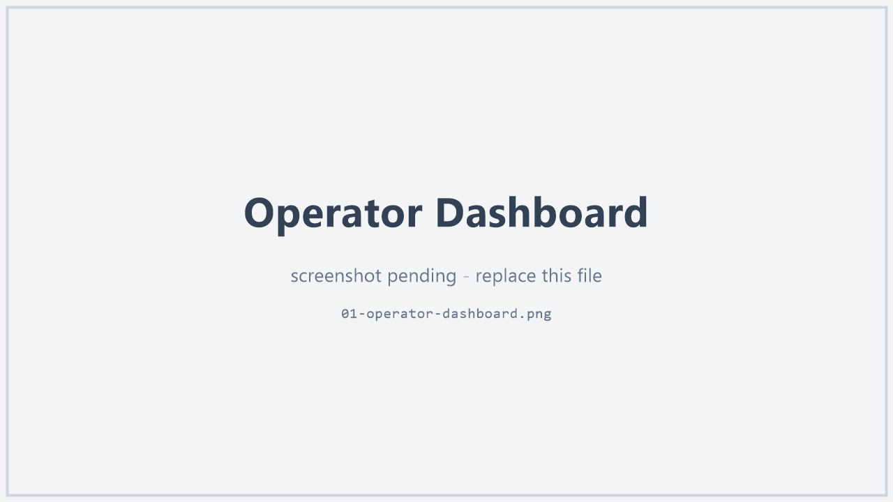
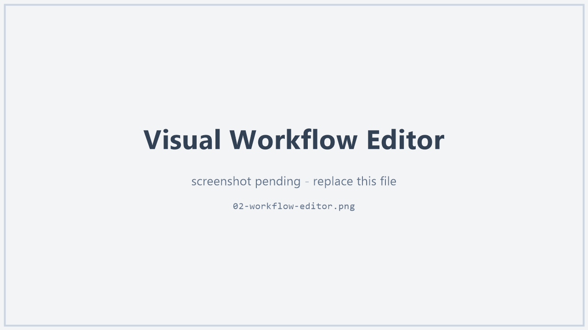
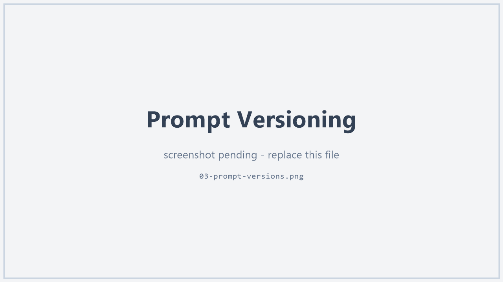
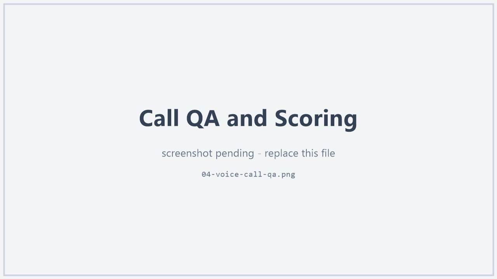
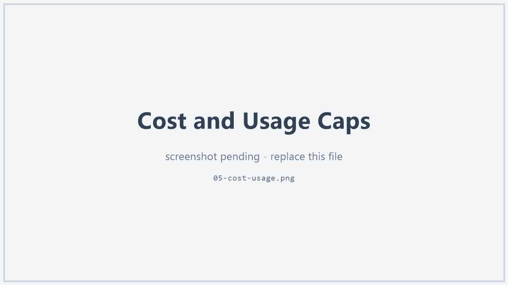
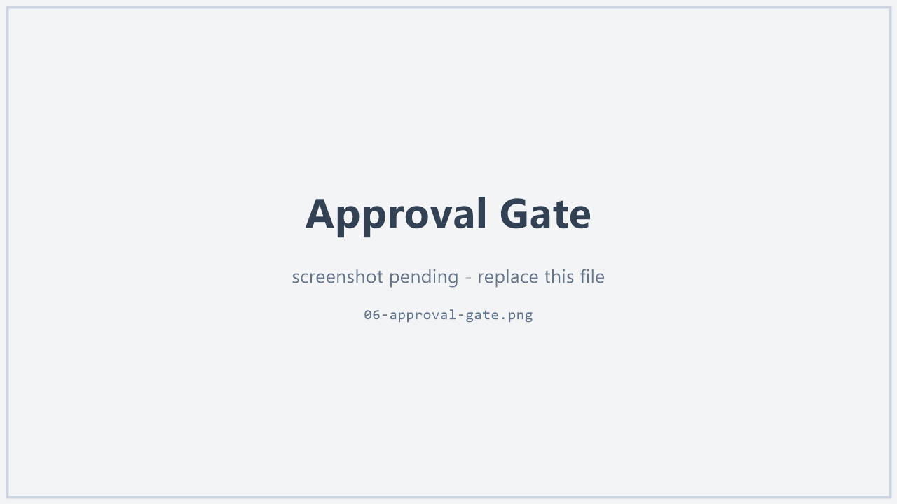
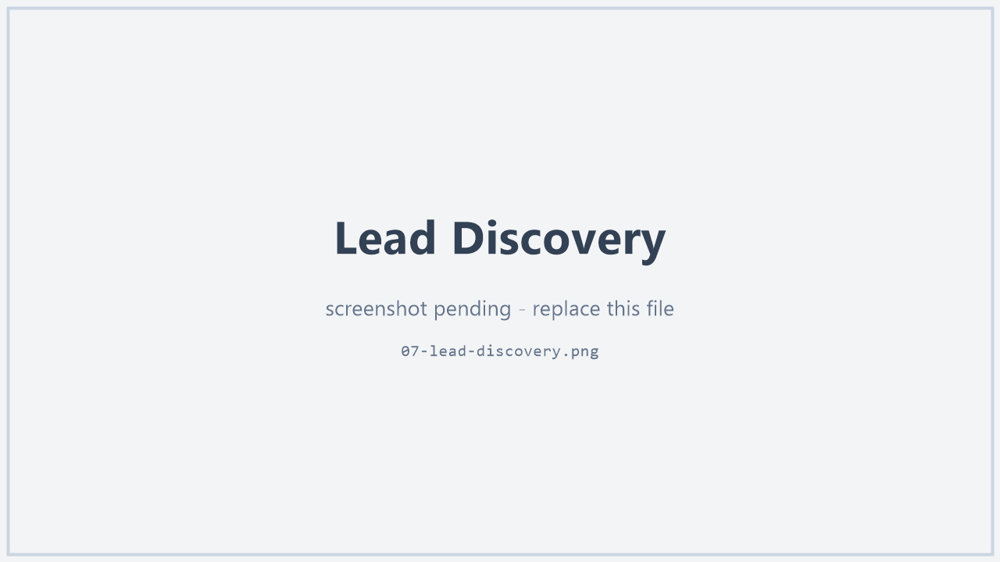
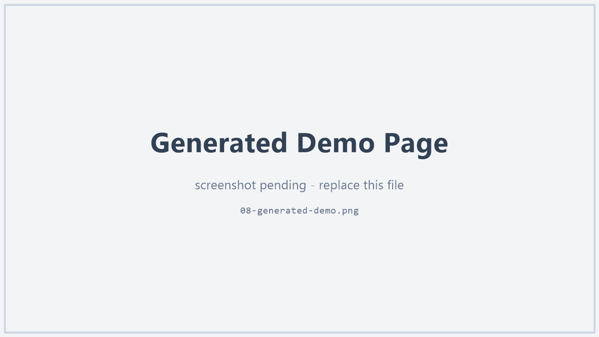
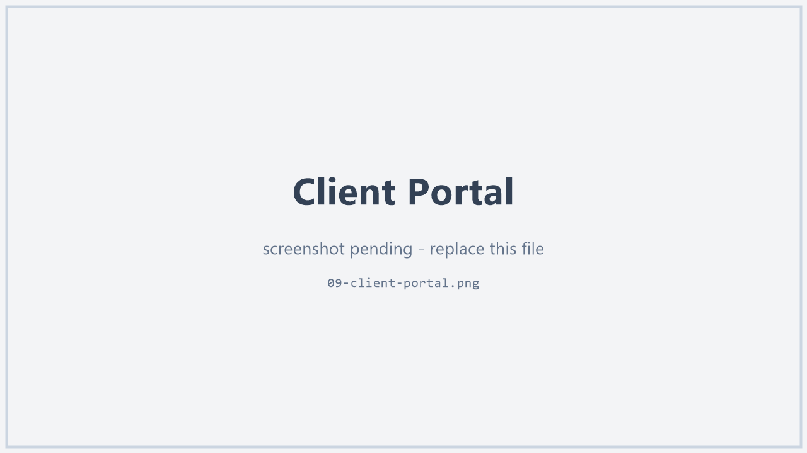

# BlixNex — AI Workflow Automation & Operations Platform

**BlixNex is a multi-tenant workflow automation platform for local service businesses.** It brings together lead discovery, personalized demo generation, AI voice reception, booking, follow-up, reputation workflows, and visual automation into one operator-supervised system.

This repository is a sanitized public case study built to show how I scope messy workflows, design AI-assisted systems, apply responsible-AI guardrails, and document systems for handoff.

> **What this repository is:** a *sanitized portfolio and case-study version* of the original BlixNex system. It contains **no** API keys, secrets, customer data, tenant records, or proprietary prompts, and it is **not** the production source code. The code samples are original, illustrative re-implementations written for this repo. Part of the generation layer is third-party open-source that I integrated rather than authored (see [Attributions](#attributions)).

<p>
  
  
  
  
</p>

## What this case study proves

- **Workflow scoping** — turning messy, interrupt-driven operations into explicit, multi-surface workflows.
- **AI-assisted system design** — multi-provider model routing, retrieval-grounded generation, and bounded QA loops.
- **Responsible-AI guardrails** — source-grounding, approval gates, cost caps, prompt-leak detection, and deterministic fallbacks.
- **Technical enablement** — multi-tenant operations and tooling an operator can actually run.
- **Handoff-ready documentation** — architecture, runbooks, and honest status, written for the next engineer.

<p align="center">
  
  <br>
  <sub>The BlixNex operator console — one multi-tenant cockpit for managing multiple local-service clients. <em>(Images are placeholders pending sanitized captures.)</em></sub>
</p>

---

## Honesty legend

Capabilities below are labeled so claims stay interview-proof:

| Label | Meaning |
|---|---|
| ✅ **Implemented** | Running code, wired end-to-end, dogfooded on an internal tenant and/or canary runs. |
| 🟡 **Partial / Canary** | Built, but operator-supervised, env-gated/feature-flagged, or validated only in canary — not the default production path. |
| 🔵 **Scaffold / Planned** | Data model, stub, or contract exists; not yet wired end-to-end. |

> **Status:** BlixNex is **solo-built, AI-assisted, pre-revenue, with zero paying customers**, and still in active development. This repository shows system design and engineering judgment — it is **not** a claim of commercial traction. The line-by-line breakdown lives in [`docs/status-and-scope.md`](docs/status-and-scope.md).

---

## Overview

BlixNex automates an end-to-end local-business customer lifecycle:

```
Discover → Demo → Answer → Book → Nurture → Reputation → Automate → Operate
```

The system helps an operator manage multiple local service business clients from one platform. Each client can receive AI-powered growth and operations support: a generated demo site, an AI voice receptionist, booking workflows, follow-up automation, review workflows, dashboards, and workflow-automation tools.

BlixNex is designed as a **working system rather than a traction claim** — the interesting engineering is the guardrailed system *around* the models, not the model calls themselves.

---

## Problem

Local service businesses lose revenue because they cannot consistently handle every operational step:

- Missed calls
- Slow follow-up
- Weak or outdated websites
- No structured review requests
- Poor lead tracking
- Manual booking coordination
- No reliable nurture system
- Limited marketing or sales-operations staff

Hiring a marketer, receptionist, automation specialist, and sales-ops team is expensive. BlixNex was built to compress that work into one operated AI platform.

---

## What I Built

BlixNex spans four major system areas:

- A **Vite** operator + client portal application
- A **Next.js** tenant + API application
- A **Railway-based render worker**
- **100+ Supabase Edge Functions**

These are tied together through Supabase, BullMQ, Redis, pg_cron, Cloudflare R2, a provider-agnostic AI layer, and integrations for voice, messaging, payments, and business-data enrichment. The demo-generation layer is built on top of an **open-source agent design daemon** (`open-design`, Apache-2.0) that I integrated — my original work is the intel → composition → QA → white-label pipeline around it (see [Attributions](#attributions)).

---

## Key Features

### 1. Autonomous Lead Discovery — ✅ Implemented
Operators launch research campaigns by niche and geography. The system uses external data sources to find local businesses, analyze their online presence, score opportunities, and prepare leads for outreach.

### 2. Personalized Demo Generation — ✅ Implemented *(daemon path)* / 🟡 *(alternate render modes are canary)*
BlixNex generates personalized demo websites from researched business intelligence. The render pipeline collects source information, composes a page, validates output, repairs issues, and publishes tenant-specific demo pages. The default production path is an agent render loop; two leaner render modes (direct-composition and template-fill) exist but are env-gated canaries.

### 3. AI Voice Receptionist — ✅ Implemented *(operator-supervised pilot)*
An AI voice receptionist — built on Retell (AI voice agent) and Twilio (telephony) — answers inbound calls using client-specific context such as business hours, services, pricing, FAQs, knowledge-base content, availability, and caller history. It helps with appointment booking, voicemail handling, transfer logic, and client-specific routing.

### 4. Post-Call QA & Intelligence Loop — 🟡 Partial *(scoring feature-flagged)*
Calls can be scored by an automated QA loop. Longer calls are evaluated across a structured rubric, and recurring failure patterns can be surfaced as **proposed** prompt improvements for operator approval — a feedback loop that monitors and improves the receptionist *without* blindly changing production behavior.

### 5. Booking & Retention Workflows — ✅ Implemented
Availability checks, appointment confirmations, no-show detection, recovery messages, open-slot auto-fill, and owner notifications — designed to reduce missed revenue and improve follow-up.

### 6. Multi-Channel Nurture — ✅ Implemented
SMS, email, and iMessage-style nurture for onboarding, re-engagement, lead follow-up, payment recovery, and cold-lead recovery. Automation is guarded by opt-out checks, claim logic to prevent duplicate sends, and channel-specific safety controls.

### 7. Reputation Workflows — 🟡 Partial
Review-request automation and **AI-drafted** review replies. Replies are drafted for operator review rather than auto-posted; automatic publishing to Google Business Profile is **not** built yet (🔵, gated on API approval).

### 8. Visual Workflow Automation Engine — ✅ Implemented
A visual trigger → condition → action engine. It is **stateful and resumable**: wait steps pause execution and resume later through scheduled processing. Supported concepts include triggers, conditions, actions, wait steps, branching, replay, execution logs, operator approval, dry-run mode, opt-out dispatch guards, and multi-tenant isolation.

> Deep dive: [`docs/workflow-engine.md`](docs/workflow-engine.md) · sanitized engine code: [`code-samples/workflow-engine/`](code-samples/workflow-engine/)

---

## AI / Claude Architecture

BlixNex uses a **provider-agnostic** AI architecture. Instead of hardcoding one model provider, the platform routes tasks across multiple providers based on use case, availability, and fallback logic.

Providers represented in the system include:

- **Anthropic Claude**
- **DeepSeek** (via OpenRouter) — the primary HTML-generation model in the render pipeline
- **OpenAI** (GPT-4.1 / GPT-4.1-mini; embeddings and image generation)
- **MiniMax**
- **Google Gemini**
- Additional routed fallback providers

**Claude is used for trust-sensitive and reasoning-heavy work**, including render-pipeline research and visual QA, structured site-editing workflows, owner-facing message drafting, workflow compose actions, and reasoning-heavy review/editing tasks.

The honest division of labor: an **open-weight model (DeepSeek) is the generation workhorse**, while **Claude is the reasoning, research, QA-critic, and drafting layer** — and Claude was also the development partner used to build the platform. The important design decision is that BlixNex does not treat AI as one generic chatbot: it routes different tasks to different models and uses Claude where judgment and trustworthiness matter most. Several AI extras (the visual-QA gate and the research agent) are **feature-flagged and off by default** in production.

> Deep dive: [`docs/ai-architecture.md`](docs/ai-architecture.md) · routing example: [`examples/sample-ai-routing-config.json`](examples/sample-ai-routing-config.json)

---

## Responsible AI Patterns

BlixNex was designed around AI safety, trust, cost control, and handoff. Full catalog: [`docs/responsible-ai-patterns.md`](docs/responsible-ai-patterns.md) (with sanitized code in [`code-samples/prompt-safety/`](code-samples/prompt-safety/)).

**Claim-Ledger Truth Enforcement.** Facts placed on a generated page must trace back to a source; unsupported facts are omitted instead of invented. This moves truth enforcement from prompt instructions into system architecture.

**LLM-as-Judge QA.** Generated pages can be reviewed by an AI QA gate that scores output for quality, positioning, brand fit, conversion strength, and factual consistency before publishing.

**Grounded Chatbots.** Chatbot behavior is grounded in client-specific knowledge, FAQs, and context, and is designed to refuse rather than fabricate unsupported claims (it will not invent a price or a phone number).

**Prompt-Leak Detection.** Streamed responses are monitored, so the system can stop output if model behavior begins exposing system instructions.

**Deterministic Fallbacks.** When AI confidence or context is insufficient, the system falls back to deterministic responses instead of fabricating.

**Cost Governance.** The platform logs model usage, latency, token counts, provider behavior, and estimated cost, and enforces per-client daily cost caps to keep AI usage bounded and affordable.

**Versioned Prompts.** Prompts are stored, versioned, activated, and archived from the dashboard, making AI behavior auditable and improvable.

**Workflow Safety.** The workflow engine uses dry-run defaults, operator approval, opt-out checks, tenant isolation, and execution replay so automations can be tested before they send real messages.

---

## Workflow Automation

BlixNex includes automation across the full customer lifecycle:

```
Lead discovered
  ↓
Business analyzed and scored
  ↓
Demo generated
  ↓
Outreach prepared
  ↓
AI receptionist answers calls
  ↓
Booking and no-show workflows run
  ↓
Nurture sequences continue follow-up
  ↓
Review requests and reputation workflows trigger
  ↓
Operator monitors performance and approves automations
```

The workflow engine supports triggers, conditions, actions, waits, branches, replay, and logging. Example workflow actions include: send SMS, send email, send payment link, book appointment, notify owner, and compose an AI-assisted message. A sanitized workflow definition is in [`examples/sample-workflow.json`](examples/sample-workflow.json); diagrams are in [`diagrams/lifecycle-architecture.md`](diagrams/lifecycle-architecture.md).

---

## Tech Stack

**Frontend** — React · TypeScript · Vite · Next.js · Tailwind CSS · shadcn/ui · Radix UI · TanStack Query · React Router · Recharts · Framer Motion · @xyflow/react

**Backend & serverless** — Supabase · PostgreSQL · Supabase Auth · Supabase Edge Functions · pg_cron · Deno · Node.js · Railway worker · Vercel

**Queue, cache & streaming** — BullMQ · Redis · Upstash · Redis Streams · Server-Sent Events

**AI & LLM providers** — Anthropic Claude · DeepSeek (via OpenRouter) · OpenAI GPT-4.1 / GPT-4.1-mini · MiniMax · Google Gemini · model-catalog and runtime-selection logic

**Generation tooling** — `open-design` agent design daemon + Markdown design-system / component library *(third-party OSS — see [Attributions](#attributions))*

**Communications & integrations** — Twilio (voice + SMS) · Retell (AI voice agent) · SendBlue (iMessage/RCS) · Resend (email) · Stripe · Apify + Google Places (business-data enrichment) · Cloudflare DNS · Cloudflare R2 · Slack alerts

**Testing & tooling** — Playwright · Vitest · Node test runner · ESLint · tiktoken

---

## Explore this repository

| Path | What's inside |
|---|---|
| [`docs/architecture.md`](docs/architecture.md) | System architecture, data flow, multi-tenancy, hosting. |
| [`docs/ai-architecture.md`](docs/ai-architecture.md) | Model routing, prompts, retrieval grounding, the QA/critic loop. |
| [`docs/responsible-ai-patterns.md`](docs/responsible-ai-patterns.md) | The guardrail catalog (problem → pattern → status). |
| [`docs/workflow-engine.md`](docs/workflow-engine.md) | Lifecycle automation and the workflow engine. |
| [`docs/handoff-runbook.md`](docs/handoff-runbook.md) | Environments, secrets, deploy, doctrines, runbooks. |
| [`docs/status-and-scope.md`](docs/status-and-scope.md) | Honest, line-by-line status matrix. |
| [`examples/`](examples/) | Sanitized workflow, AI-routing, and prompt-version artifacts. |
| [`code-samples/`](code-samples/) | Original illustrative code: workflow engine, AI routing, prompt safety. |
| [`diagrams/`](diagrams/) | Mermaid system + lifecycle diagrams. |

> The TypeScript in [`code-samples/`](code-samples/) is **strict-mode type-checked** — run `npm install && npm run typecheck` (0 errors).

---

## Security & Privacy Notes

This public repository is sanitized for portfolio review. Practices represented here include:

- No API keys, tokens, or secrets committed to GitHub — live secrets stay in deployment environments
- Multi-tenant isolation patterns; tenant identity derived from trusted database rows rather than user input
- Per-channel opt-out guards and HMAC unsubscribe patterns
- Operator approval gates for client-triggered automations
- Prompt-leak detection and AI usage cost caps
- Versioned prompts and observability logs
- Pre-revenue status clearly labeled

---

## Documentation & Handoff

BlixNex was built with handoff in mind. Documentation patterns include agent instructions and cross-agent development contracts, issue tracking as a source of truth, decision-memory documentation, feature-handoff notes, workflow maps, setup/deploy notes, AI-trust runbooks, and incident-response notes for provider limits, failed crons, and automation issues.

The goal is not just a system that works while the original builder is present — it's a system another operator, contributor, or AI-assisted developer can understand and continue safely. See [`docs/handoff-runbook.md`](docs/handoff-runbook.md).

---

## What I Learned

Building BlixNex taught me that useful AI systems are not just model calls — the hard part is the system around the model.

- Correctness matters more than cleverness
- Guardrails belong in code, not only in prompts
- AI systems need source-of-truth boundaries
- Cost controls must be designed early
- Consent and opt-out logic are core infrastructure
- Multi-tenant automation requires strict isolation
- Dry-run modes make automation safer
- Documentation and handoff are part of the product
- Honest labels matter: implemented, partial, scaffold, and planned should not be blurred together

---

## What I Would Improve

- More production validation around the render claim-ledger system
- Stronger replay-based testing for workflow automation
- Cleaner public demo-data separation
- More complete subscription charge-collection flows
- Stronger observability dashboards for AI provider behavior
- Additional nonprofit / public-interest workflow templates
- More non-technical operator guides and walkthroughs
- A clearer setup wizard for onboarding new client businesses

---

## Screenshots / Demo

> The images below are **placeholders pending sanitized captures.** Replace each file in [`screenshots/`](screenshots/) with a real screenshot of the **same filename** and it appears here automatically. Redact any real customer names, phone numbers, emails, addresses, or internal URLs first — the cleanest approach is to seed a demo tenant with fake data and capture that. *(The operator console is shown at the top of this page.)*

#### Visual workflow engine — trigger → condition → action automations with branching, waits, and replay


#### Versioned prompts — AI behavior stored, versioned, activated, and archived for auditability


#### Call QA & intelligence loop — calls scored against a rubric, with proposed prompt improvements held for operator approval


#### Cost governance — per-client token / cost / latency logging and daily spend caps


#### Human-in-the-loop — consequential actions are staged as drafts and require explicit owner approval


#### Autonomous lead discovery — research campaigns by niche and geography, with opportunity scoring


#### Personalized demo generation — a tenant-specific marketing site produced by the render pipeline


#### Client portal — the per-client view: dashboards, bookings, conversations, reputation, and settings


---

## Status & Scope

BlixNex is solo-built, AI-assisted, pre-revenue, and still in active development. This case-study repository is intended to show system design, AI workflow architecture, responsible automation, and handoff-ready engineering. **It should not be interpreted as a claim of paying customers or commercial traction.**

The strongest part of the project is not just that it uses AI — it's that it uses AI **with guardrails**: grounded knowledge, claim-ledger truth enforcement, prompt-leak detection, deterministic fallbacks, cost caps, opt-out checks, dry-run workflow safety, and handoff documentation. Full matrix: [`docs/status-and-scope.md`](docs/status-and-scope.md).

---

## Attributions

- **`open-design`** (org `nexu-io`, **Apache-2.0**) — the agent-native design-system / component library and render daemon used by the generation layer. I **integrated and built on** this; I did not author it. The original engineering in BlixNex is the pipeline around it (intel, prompt construction, validation, QA/critic, white-labeling, cost control). It remains governed by its own license.
- **Claude / Claude Code** (Anthropic) — development partner and several runtime roles (research, visual QA, drafting, site-editing).
- Standard infrastructure: Supabase, Vercel, Railway, Cloudflare, Stripe, and the communications and data providers noted above — property of their respective owners.

---

## License & contact

**© 2026 Bill Kaduru — All Rights Reserved.** This case-study repository is published for portfolio and evaluation purposes only; it is **not** open-source software. See [`LICENSE.md`](LICENSE.md) for full terms. Any third-party components referenced here remain governed by their own licenses (see [Attributions](#attributions)).

**Author:** Bill Kaduru · [@BlixCodec](https://github.com/BlixCodec) · _(contact details intentionally omitted from the public repo — see the maintainer's GitHub profile)._
