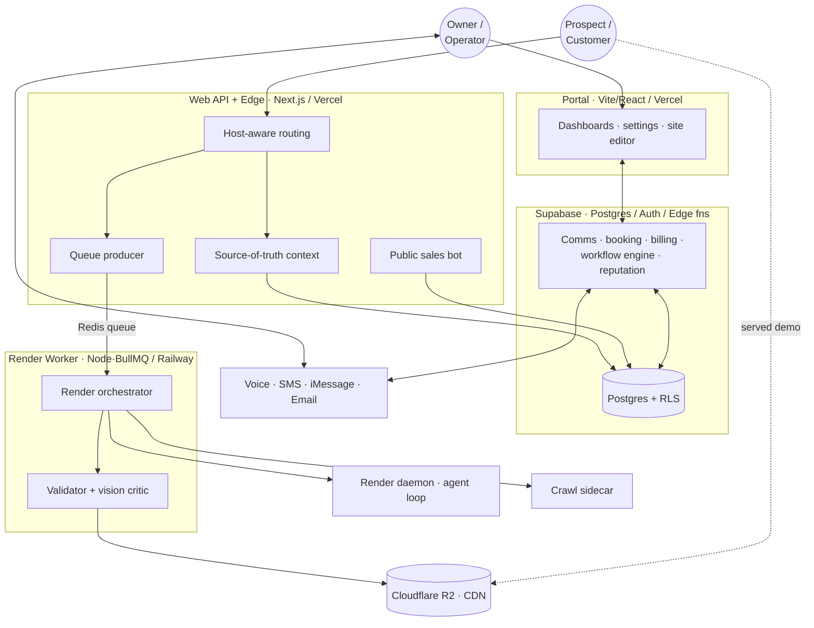
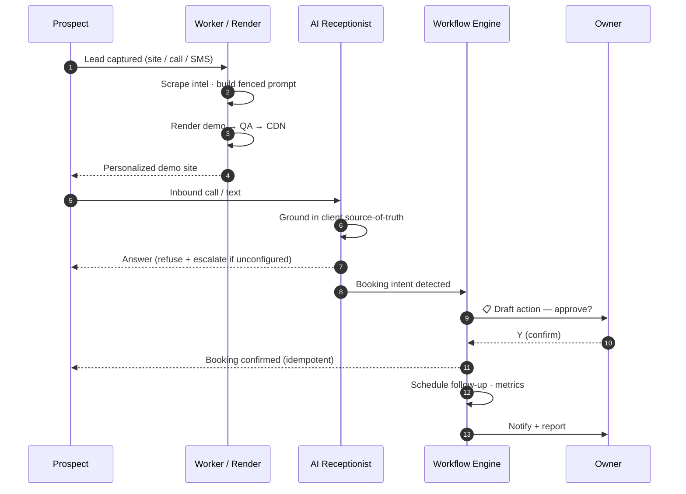
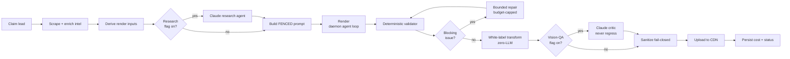
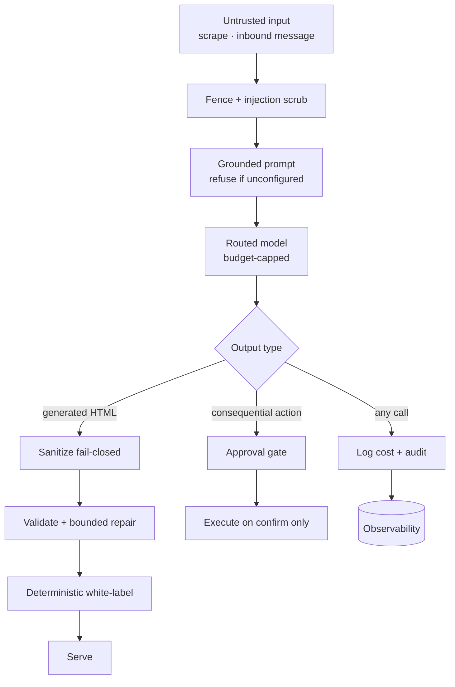

# Lifecycle & Architecture Diagrams

Mermaid diagrams (GitHub renders these natively). Sanitized — placeholders only.

---

## 1. System architecture

---

## 2. Lead → customer lifecycle

---

## 3. Render pipeline (with guardrails)

---

## 4. Responsible-AI defense-in-depth

