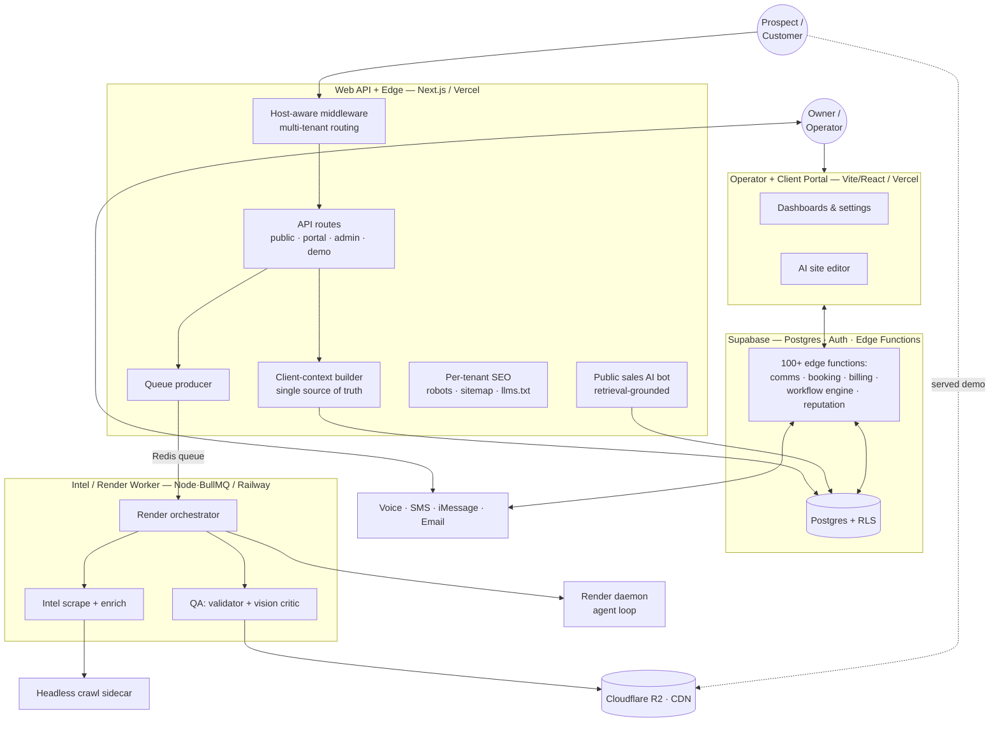

# Architecture

How the platform is structured, how data flows, and why the boundaries are where they are.

> Sanitized: internal hostnames, shared-secret schemes, and customer identifiers are replaced with neutral placeholders. Status labels follow the [honesty legend](../README.md#honesty-legend).

---

## 1. System context

BlixNex is a small number of single-responsibility services around a shared Postgres (Supabase). Each service owns one concern; the database is the integration backbone.



---

## 2. The services

| Service | Runtime / host | Owns | Status |
|---|---|---|---|
| **Web API + Edge** | Next.js · Vercel | Multi-tenant request routing, per-tenant SEO surfaces, the public sales bot, the client-context (source-of-truth) builder, billing, and the render-queue producer. This is the **API backbone** — it deliberately does *not* own the product UI. | ✅ |
| **Operator + Client Portal** | Vite + React · Vercel | The human surface: operator workspace and per-client portal (dashboards, settings, brand profile, site editor, conversations, bookings, reputation, workflows). | ✅ |
| **Supabase backend** | Postgres · Auth · Deno edge functions | The integration backbone: the relational model + row-level security, plus 100+ edge functions handling comms webhooks, booking, billing lifecycle, the workflow engine, and reputation. | ✅ |
| **Intel / Render worker** | Node · BullMQ · Railway | Async heavy lifting: prospect intel scraping/enrichment and the demo-render orchestration (render → QA → CDN), with cost caps and telemetry. | ✅ |
| **Render daemon** | Agent-loop service · Railway | Executes the actual agentic HTML generation (tool-use, file-write, streamed events). *Built on third-party OSS — see [Attributions](../README.md#attributions).* | ✅ |
| **Crawl sidecar** | Headless-browser service · Railway | Renders untrusted prospect sites to clean Markdown for retrieval, behind an SSRF boundary. Opt-in. | 🟡 |
| **Storage / CDN** | Cloudflare R2 (S3 API) | Stores generated demo HTML/assets; served to prospects. | ✅ |

**Why split this way:** rendering is slow, expensive, and failure-prone, so it lives in an async worker that can be scaled, budget-capped, and killed independently of the request path. The portal is a separate SPA so UI iteration never risks the API. The database is the single integration point, which keeps the services loosely coupled and individually deployable.

---

## 3. The lead → customer lifecycle (data flow)

The platform is organized around one spine: turning a prospect into a managed customer relationship.

1. **Discover** — a lead is captured; the worker scrapes the prospect's site + business profile and extracts brand, palette, and logo. An optional Claude research agent adds competitive context.
2. **Generate** — the render orchestrator builds a fenced prompt from that intel and produces a personalized, white-labeled demo site, which is QA'd and uploaded to the CDN.
3. **Engage** — outreach goes out; inbound calls/texts hit the AI receptionist, grounded in the specific client's data.
4. **Convert** — the AI books the job (with validation and confirmations) or escalates to the owner.
5. **Retain** — follow-up crons, review-reply drafting, and review requests keep the relationship warm.
6. **Report** — usage, cost, conversations, and outcomes roll up into per-tenant dashboards; the owner can query the "Insight" brain directly.

Each transition is an explicit state in Postgres, which is what makes the workflow engine (see [`workflow-engine.md`](workflow-engine.md)) able to react to events deterministically.

---

## 4. Multi-tenancy model

Tenancy is the architectural backbone, and it's resolved at the edge:

```
Incoming host  ──►  custom_domains (active)  ──►  client_account_id
                                                        │
                                                        ▼
                                          client brand profile + config
                                                        │
                                                        ▼
                                    per-tenant render / SEO / AI context
```

- **One code path, many tenants.** A custom domain hitting `/` is rewritten to a tenant edge route that resolves the account and renders that tenant's branded content — no per-tenant code.
- **Isolation.** Every query is scoped to a `client_account_id`. Operator impersonation is gated and audit-logged. Row-level security backs the model in the database. *(Honest caveat: comprehensive table-by-table RLS verification is an ongoing hardening task — tracked in [`status-and-scope.md`](status-and-scope.md).)*
- **Discovery hygiene.** Platform hosts are `noindex`; tenant custom domains get their own `robots`, `sitemap`, and `llms.txt` generated from the brand profile, with platform attribution deliberately stripped so a tenant's brand isn't tied back to the platform.

---

## 5. Hosting & runtime topology

| Concern | Choice | Notes |
|---|---|---|
| Web API / portal | Vercel | Auto-deploy on merge; preview deploys per branch. |
| Worker / daemon / sidecar | Railway | Long-running; Docker; private service-to-service networking. |
| Data / auth / functions | Supabase | Postgres + Deno edge functions co-located with data. |
| Queue / pub-sub | Redis (BullMQ) | Job queue + render milestone streaming. |
| Object storage / CDN | Cloudflare R2 | S3-compatible; public read for served demos. |
| Secrets | Platform env vars only | Never in the repo; `.env.example` is the contract. See [`handoff-runbook.md`](handoff-runbook.md). |

---

## 6. Cross-cutting concerns

- **Security boundaries** — SSRF guards on every server-side fetch of a user-supplied URL; fail-closed HTML sanitization before anything is served; strict security headers at the edge. See [`responsible-ai-patterns.md`](responsible-ai-patterns.md).
- **Cost control** — the render path is budget-capped at multiple layers because generation is the dominant variable cost.
- **Observability** — structured error logs, an audit trail for sensitive actions, per-call LLM cost/token logging, and named render telemetry events.
- **Change safety** — operational doctrines (e.g. *never deploy while a render is in flight*) are documented in the runbook, because a naive redeploy can orphan in-flight agent work.

---

## 7. Honest architectural notes

- The **render daemon and the design-system/component library it uses are third-party open-source** that I integrated — not original work. The original engineering here is the *pipeline around it*: intel, prompt construction, QA/critic, budget control, white-labeling, and the tenant model.
- The **render workhorse model is DeepSeek (via OpenRouter)**, not Claude. Claude is the research, QA-critic, drafting, and site-editor layer. See [`ai-architecture.md`](ai-architecture.md).
- Several AI features are **env-gated and off by default** in production (research agent, vision-QA gate, alternate render modes). The default production render path is the daemon agent loop.
- This is a **pilot-grade** system: real architecture and real guardrails, operated under supervision, with zero paying customers to date.
