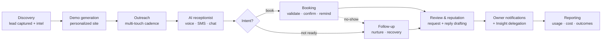

# Workflow Engine & Lifecycle Automation

How discrete surfaces (voice, SMS, booking, follow-up, reputation) compose into automated lifecycles, and the engine that drives them.

> Status labels follow the [honesty legend](../README.md#honesty-legend).

---

## 1. The automation spine

Every BlixNex surface is a step in one lifecycle. The workflow engine is what reacts to events along that spine and runs the next step.



| Stage | Surface | Status |
|---|---|---|
| Discovery | Intel scrape + enrichment (+ optional research agent) | ✅ / 🟡 |
| Demo generation | Agentic render pipeline → QA → CDN | ✅ |
| Outreach | Multi-touch email/SMS cadence | ✅ |
| AI receptionist | Programmable voice + conversational SMS/chat | ✅ *(supervised)* |
| Booking | Slot validation, calendar sync, confirmations, reminders, no-show/deposit | ✅ |
| Follow-up | Speed-to-lead, cold-lead recovery, abandoned-prospect crons | ✅ |
| Review & reputation | AI-drafted replies + review-request automation (auto-publish 🔵 not built) | 🟡 |
| Owner notifications | In-app, push, email, owner-SMS | ✅ *(push partial)* |
| Insight delegation | Owner asks for reports / takes actions via approval gates | ✅ *(text/portal)*, 🟡 *(voice)* |
| Reporting | Per-tenant dashboards, usage metering, cost tracking | ✅ |

---

## 2. The engine model

The workflow engine is a **trigger-driven graph executor**. Conceptually:

- **Trigger** — an event (`lead.created`, `call.completed`, `booking.no_show`, a schedule) starts a workflow.
- **Nodes / steps** — each node is either an **action** (a grounded operation: send a message, update a lead, book a slot, run an audit) or an **LLM step** (draft, classify, summarize).
- **Step queue** — steps are enqueued and processed asynchronously, so a long-running or delayed step (a 3-day follow-up) doesn't block anything.
- **Validator + safety guard** — a workflow definition is validated before it runs, and consequential actions pass through the same approval gates described in [`responsible-ai-patterns.md`](responsible-ai-patterns.md).
- **Crons** — scheduled workflows handle lifecycle recovery (cold leads, abandoned prospects, no-shows, overage billing).

A sanitized, runnable illustration of the executor (state machine, idempotency, approval gating, deterministic fallback) is in [`../code-samples/workflow-engine/`](../code-samples/workflow-engine/). An example workflow definition is in [`../examples/sample-workflow.json`](../examples/sample-workflow.json).

---

## 3. Action safety

Actions are where automation meets the real world, so they carry the strongest guarantees:

- **Approval-gated by default** for anything that messages a customer, books a job, or moves money — staged as `pending_approval`, previewed to the owner, executed only on explicit confirmation.
- **Idempotent** — booking and send operations resolve against unique constraints so a retried step can't double-book or double-send.
- **Tenant-scoped** — every write is bound to one `client_account_id`.
- **Grounded** — action inputs come from the source-of-truth context, not free-form model output.
- **Bounded** — AI-emitted payment amounts are capped; LLM steps are cost-capped.

---

## 4. The "Insight" delegation loop

The owner-facing half of the engine is what makes it feel like staff rather than software.

1. The owner texts their **own business number** (or uses the portal) — *"how many leads today?"*, *"text the Johnson lead a quote."*
2. The Insight brain answers reporting questions from the source-of-truth context, and for **actions** returns a **draft preview** (`📋 Draft — reply Y to send`).
3. On `Y`, the staged action executes; on `N`, it's cancelled.

This keeps a human in the loop for everything consequential while still removing the keyboard-and-desk bottleneck.

- **Status:** ✅ for text/portal channels; 🟡 for the voice channel (the owner-channel brain itself is grounded and approval-gated, with the voice path operator-supervised).

---

## 5. Worked example

A typical `new-lead-nurture` workflow (see the JSON in [`../examples/sample-workflow.json`](../examples/sample-workflow.json)):

```
trigger: lead.created
  → step: ai_qualify            (LLM, grounded)         → classifies intent
  → branch: high_intent?
       yes → step: draft_booking (action, APPROVAL GATE) → owner confirms
             → step: send_confirmation (action, idempotent)
             → step: schedule_followup (+24h)
       no  → step: enqueue_nurture (cadence, +1d/+3d/+7d)
  → on no_show: step: recovery_offer (action, APPROVAL GATE)
  → always: step: notify_owner   (notification)
            step: record_metrics  (reporting)
```

Every LLM step is grounded and budget-capped; every customer-facing or money-moving step is approval-gated and idempotent. That combination — automated flow, human-gated consequences — is the design center of the whole engine.

---

## 6. Honest limitations

- **Review/reputation auto-publish is not built** — replies are AI-drafted and copy/pasted pending external API approval. Labeled 🟡.
- The **engine runs under operator supervision** in the current pilot posture; it is not certified for unattended production use.
- Some lifecycle surfaces are **single-vertical** today (the per-vertical breadth is roadmap, not shipped — see [`status-and-scope.md`](status-and-scope.md)).
